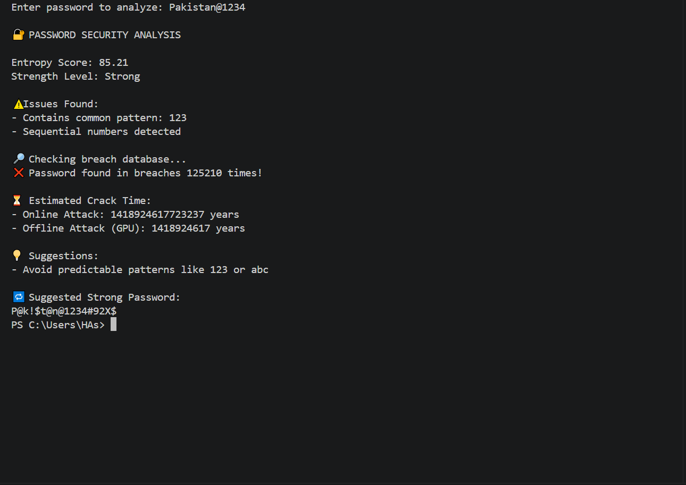

# Password Security Analyzer

An advanced password analysis tool built in Python that evaluates password strength using entropy, detects vulnerabilities, checks against known data breaches, and simulates real-world attack scenarios.

---

# Overview

This project demonstrates practical cybersecurity concepts by analyzing passwords beyond basic rules. It combines mathematical strength analysis, pattern detection, and real-world breach checking to provide meaningful security insights.

 

# Features

* Entropy-based password strength calculation
* Detection of weak patterns (e.g., `123`, `qwerty`, repeated characters)
* Breach detection using k-anonymity API
* Estimated crack time (online and offline attacks)
* Smart suggestions for improving password strength
* Password mutation generator

---

# How It Works

1. Entropy Calculation
   Calculates password randomness using character pool and length.

2. Pattern Detection
   Identifies predictable sequences and common weak patterns.

3. Breach Check
   Uses SHA-1 hashing and k-anonymity to check if the password exists in known leaks.

4. Attack Simulation
   Estimates how long it would take to crack the password.

5. Suggestions Engine
   Provides personalized recommendations to strengthen the password.

---

# Technologies Used

* Python
* `re` (Regular Expressions)
* `math` (Entropy calculation)
* `hashlib` (SHA-1 hashing)
* `requests` (API integration)

---

# Installation

Clone the repository:

```bash
git clone https://github.com/HasnainRaza67/password_scanner.git
cd password_scanner
```

Install dependencies:

```bash
pip install requests
```

---

# Usage

Run the program:

```bash
python password_scanner.py
```

Enter a password when prompted:

```text
Enter password to analyze: mypassword123
```

---

# Example Output

```text
PASSWORD SECURITY ANALYSIS

Entropy Score: 47.2
Strength Level: Moderate

Issues Found:
. Contains common pattern: 123

Checking breach database...
Password found in breaches 15234 times

Estimated Crack Time:
. Online Attack: minutes
. Offline Attack (GPU): seconds

Suggestions:
. Use at least 12 characters
. Add uppercase letters
. Add special characters
. Avoid predictable patterns

Suggested Strong Password:
Myp@$$w0rd#92X$
```

---

# Security and Privacy

* Passwords are not stored or logged
* Uses k-anonymity to protect user data during breach checks
* Only partial hashes are sent to the API

---

# Limitations

* Depends on external API availability
* Uses estimated crack speeds
* Limited pattern detection (can be expanded)

---

# Future Improvements

* GUI interface (Tkinter or Web app)
* Machine learning-based strength prediction
* Password blacklist expansion
* Export reports (PDF/CSV)

---

# Author

Hasnain Raza
Cyber Security Student

---

# License

This project is open-source and available under the MIT License.

---

# Support

If you found this project useful, consider giving it a star on GitHub.

---

# Output


